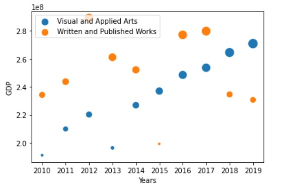
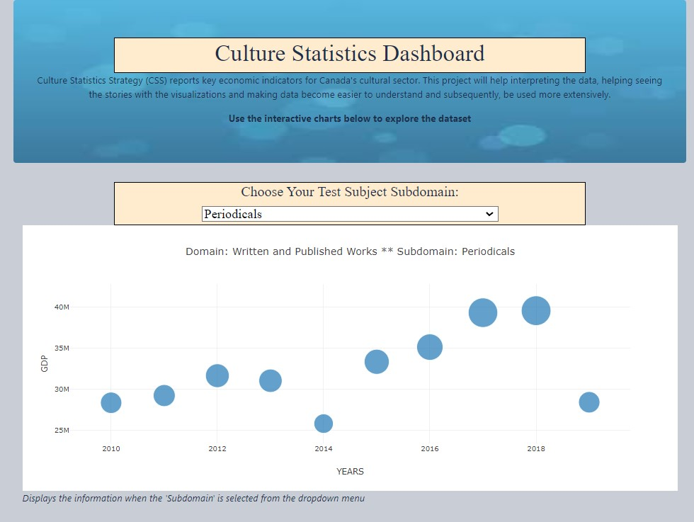

# Culture-Statistics-Strategy
# Overview: 
Culture Statistics Strategy (CSS) reports key economic indicators for Canada's cultural sector. CSS estimates the production of culture and sport goods and services and their contribution to output, GDP, and jobs.
## Purpose: 
This project will help staff interpreting the data, seeing the stories with the right visualizations and making data become easier to understand and subsequently, be used more extensively.

### Tools: 
Javascript, Python, HTML, D3.js, PostgreSQL, pgAdmin, Jupyternotebook, plotly, matplotlib, numpy, seaborn, pandas
## Hypothesis
Culture GDP is the economic value added associated with culture activities and it is the value added related to the production of culture goods and services across the economy, regardless of the producing industry. The 2010 estimates were derived primarily from the 2010 datasets with specific methodologies used to isolate the culture and sport industries for each province and territory. Since 2010 all culture and sport industries and activities are identified to estimate GDP and jobs . For example the culture GDP of Ottawa had been estimated to be more than $3 billion in 2016. Predicting GDP of culture and sport industry using regression models will help estimation of future GDPs.
# Analysis
The data came from CSS in excel format and was loaded up to do ETL in python and pgAdmin. Two tables were created and used for ML and dynamic visualization. Simple __Linear Regression Supervised Machine learning__ algorithm was used for a data shaped by 10x2. Data columns were for Years, Domain and GDP. I used the linear regression model for only one domain; Visual and Applied Arts.
__X : Years 	Y: GDP__
Result of the prediction was at an __accuracy of 84%__. __Mean square error__ is extremely high, __78135108__.  The value of __root mean squared error is 8.83__, which is less than __4%__ of the mean. The value of the percentages of all the GDP's 231.9. This means that the algorithm did a decent job. As a result of linear regression I can conclude that my model overfitting my dataset, the machine is memorizing the trend and not actually learning. The model is saved as pickle file.
__Training score: 89%       Testing score: 84%__

 My second ML model was __Random Forest__. 
  Random Forest data gave normal results for training the data but testing data it gave __0% accuracy__ result and testing score of zero.
  This result tells me that my model underfitting my data set. It fits exactly against its training data. Random Forest algorithm can't perform accurately against unseen data, defeating its purpose.
  
Visualization of the domains were done using functional javascript allowing user to choose a domain and see the visuals for GDP vs Years.

### Presentation Link
You can access the presentation file in [Google Sheets](https://docs.google.com/presentation/d/1eykUAEVyZOpPEXRaDuh3WofGQ5-t2zRm/edit?usp=sharing&ouid=115735941734879015175&rtpof=true&sd=true)
and watch the presentation [Video](https://drive.google.com/file/d/138MKXh4yEpzRTTlMdoUjbVFyI4UyR4ji/view?usp=sharing)

# Summary: 
GDP fluctuates for each subdomain and each year from 2010-2019. The result of ML analysis show that actual GDP and predicted GDP are close for the predicted output. Linear regression algorithm shows that the root mean squared error is 8.83 which is less than the 4% of the mean value of the percentages of all the GDPs. This means that the linear algorithm did a decent job but the model overfitting my dataset, the machine is memorizing the trend and not actually learning. As for the Random Forest model it is underfitting the dataset, the testing score is 0%. Dynamic visualization of subdomains were created in javascript, d3, & html. Plot is displaying Year - GDP values which shows the fluctuating revenue.

