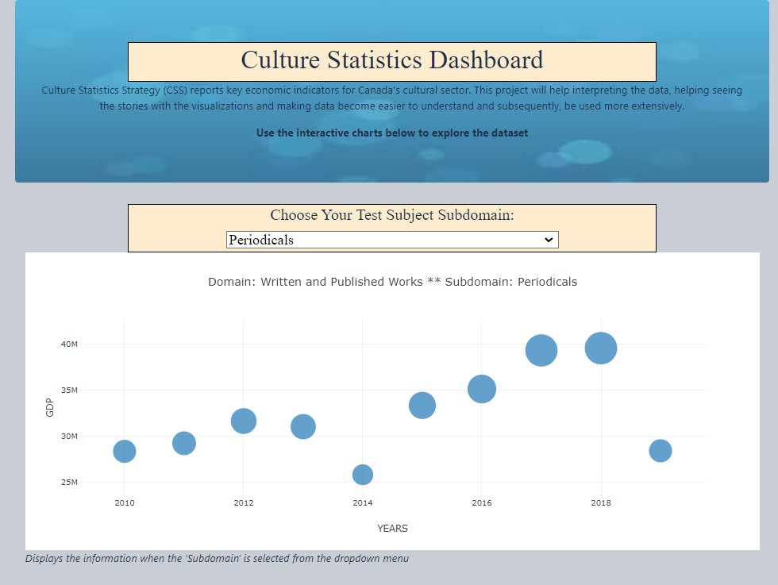

## Self-Assessment:
### __Proficiency:__
__Roles:__ This is an individual project. I’ve decided to ask around for a real-life issue that I could help with. In return I was contacted by a Data Analyst department of City of Ottawa. I had a meeting with the interested party and after a discussion with my instructor I’ve decided that it was a good size project to complete by myself. 
Culture Statistics Strategy (CSS) reports key economic indicators for Canada’s cultural sector. CSS estimates the production of culture and sport goods and services and their contribution to output, GDP and jobs. The purpose of this project is to help staff interpreting the data, seeing the stories with the right visualizations and making data become easier to understand and subsequently, be used more extensively.
I had meetings with my instructor and discussed which of the python, databases, visualization and advanced topics units I would need to use. I’ve started to use a bubble diagram with slider as part of my visualization using plotly. 
__Contribution:__ I would like to thank you to the Cultural Mapping and Research Officer who gave me the opportunity to work on this real issue and data. He has contributed to the project by explaining the features in the dataset and the relations of the features in the dataset. He gave me the data source and I was able to search the website content in detail to understand the history of data and the description of data. I also thank my instructor Andrew Hoang and Yagnesh Jani for their direction and positive input to the project.
__Challenges:__  My dataset was small. It also had very limited number of features. Also, the dataset I had consist of 22 subsets which needed to be analysed individually for advanced topics.
### __Approaching Proficiency:__
__Roles:__ Culture and Sports data came from CSS in excel format. Culture GDP field is the economic value added associated with culture activities and it is the value added related to the production of culture goods and services across the economy, regardless of the producing industry. The 2010 estimates were derived primarily from the 2010 datasets with specific methodologies used to isolate the culture and sport industries for each province and territory. Since 2010 all culture and sport industries and activities are identified to estimate GDP and jobs. For example the culture GDP of Ottawa had been estimated to be more than $3 billion in 2016. Predicting GDP of culture and sport industry using regression models will help estimation of future GDPs.
I started cleaning the dataset first using ETL then sending it to pgAdmin and exporting it as a .csv file.
__Contribution:__ Non-culture and non-sport product calculations were included in sub-totals. I needed more clarification on the sub-total and total GDP before removing these numbers from the calculations. Cultural Mapping and Research Officer was able to help me understand the data that should be included in the sub-total and that the non-culture and non-sport products are considered a subdomain. I transformed my data accordingly into pgAdmin as SQL tables. Also starting working on index.html file for the dynamic visualization of the dataset.
__Challenges:__ After working on my bubble chart with slider feature a long time, It turned out that it really wasn’t possible with the dataset I had. I needed more features that would really decide on the size of the bubbles other than the GDP and the years. Thank you to Andrew and Yagnesh for helping me to move on and start with a different type of visualization for my dataset. I also needed to remember my html skills and visited the projects that I used html. I applied a similar approach for my data visualization. Another challenge was researching and reading so much about the linear regression and random forest algorithms and applying it on real data.

### __Developing Proficiency:__
__Roles:__ Two tables were created and used for ML and dynamic visualization. Simple __Linear Regression Supervised Machine learning__ algorithm was used for a data shaped by 10x2. Data columns were for Years, Domain and GDP. I used the linear regression model for only one domain; Visual and Applied Arts.
__X : Years   Y: GDP__
Result of the prediction was at an __accuracy of 84%__. __Mean square error__ is extremely high, __78135108__.  The value of __root mean squared error is 8.83__, which is less than __4%__ of the mean. The value of the percentages of all the GDP's 231.9. This means that the algorithm did a decent job. 

 My second ML model was __Random Forest__. 
  Random Forest data gave normal results for training the data but testing data it gave __0% accuracy__ result and testing score of zero.
  
Visualization of the domains were done using functional javascript allowing user to choose a domain and see the visuals for GDP vs Years.

__Contribution:__ I used the following tools: Javascript, Python, HTML, D3.js, PostgreSQL, pgAdmin, Jupyternotebook, plotly, matplotlib, numpy, seaborn, pandas. I also used screen shot for the my video presentation of the project. Plots were included in the source code and presentation that showed the results of the ML algorithms. I created a link to the dynamic site where the user could access from github and see the visualizations for the the Year vs GDP data. Visualization of the domains were done using functional javascript allowing user to choose a domain and see the visuals.

__Challenges:__  Since my dataset had less features and small data I wasn’t able to use neural networks and used supervised methods instead. Linear regression ML gave good results but Random Forest model ended up with zero percent accuracy meaning that it fits its training data. I had some challenges during the implementation of data visualization in Javascript and the push event to the github. My instructor was able to guide me and I was able to use plotly to display my plots. My data source was not found although I could see it in the sub directories. Manually adding the datasource within github solved the problem.

### __Emerging:__
__Summary:__  As a result of linear regression I can conclude that my model overfitting my dataset, the machine is memorizing the trend and not actually learning. GDP fluctuates for each subdomain and each year from 2010-2019. The result of ML analysis show that actual GDP and predicted GDP are close for the predicted output.
__Training score: 89%       Testing score: 84%__

The result for the Random Forest model tells me that my model underfitting my data set. Accuracy was 0%. It fits exactly against its training data. Random Forest algorithm can't perform accurately against unseen data, defeating its purpose. Dynamic visualization of subdomains were created in javascript, d3, & html. Plot is displaying Year - GDP values which shows the fluctuating revenue. I'll work with CSS to get more features for this data to be able to run unsupervised algorithms and make better predictions. I will also run supervised algorithms on each of the subsets that the client would like to have. Another piece that I would like to add to this project is heatmaps for each of the subdomains showing GDP's.

 

